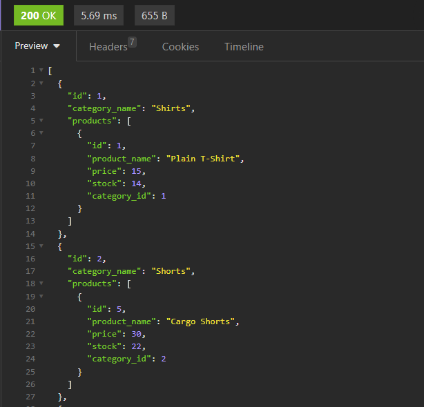
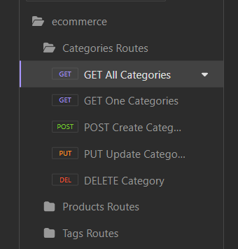
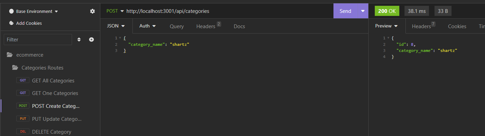

# My eShop 3000

## Description 
- This application was created out of the need to get some practicall application experience creating models, routing, and seeding using sequilize, and mysql2. In this application, we have to create tables in the database that we are going to access, and alter the infomation. We used sequelize to create code in which we can seed the tables and edit the info in the tables. The result of this all of these processes working together is a fully fucntioing back-end database app. It can be used for a veriety of purposes, but the target it to keep track of supplies. For example, an ecommerce website might use this infromation to keep track of their inventory.
  

## Installation
- Intallation is fairly simple. All you would need it to clone a copy of the repo into your local enviroment. After that is done, you open it up, and run 'npm i' to install the dependincies. And now your app is installed and ready for what ever you want.

## Usage
- To use this app, you would need change the routes in the url to match what your have in your route paths for their respective api. Insomnia is what we used to test that the endponts are working and are able to genereate some data. If you were to use insomnia, make, crud operation calls to each of the Categories, Products, and Tags page. Once you have the Crud operation, you are able to access all the endpoints and retrieve, post, edit, and delete what ever data you want.

## Images

## Credits
- My github url: https://github.com/Sal1316/my-eshop-3000
- Video url: 